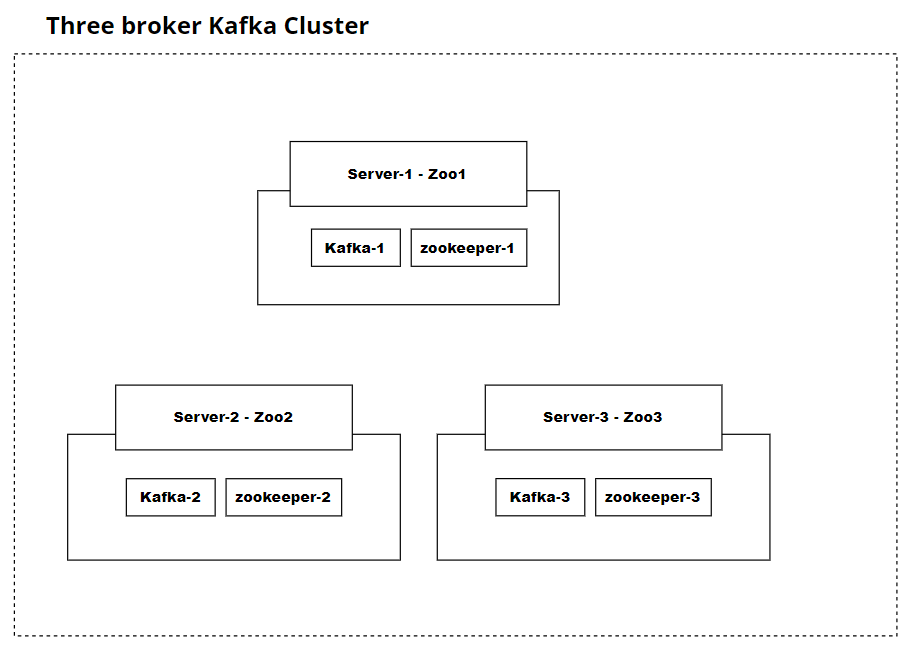

# Building a Kafka Cluster with Confluent



## **Introduction**
This guide is to shows how to install and configure three broker kafka cluster using Confluent Community on 3 linux servers.

The cluster should have 3 nodes.
- Server-1 
  - private ip: 10.0.1.101,
  - hostname: zoo1
- Server-2
  - private ip: 10.0.1.102,
  - hostname: zoo2
- Server-3
  - private ip: 10.0.1.103,
  - hostname: zoo3

## **Prerequest**
1. 3 ubuntu servers/vms (OS prefer - `Ubuntu 20.04.5 LTS`)

## **Steps**
 ### **Install Confluent Community Package on Broker Nodes**
 1. Login into the 3 server (Server-1,Server-2,Server-3)
 2. On all three servers, add the GPG key:
    ```
    wget -qO - https://packages.confluent.io/deb/5.2/archive.key | sudo apt-key add -
    ```
 3. On each server, add the package repository:
    ```
    sudo add-apt-repository "deb [arch=amd64] https://packages.confluent.io/deb/5.2 stable main"
    ```
 4. On each server, install Confluent Community and Java:
    ```
    sudo apt-get update && sudo apt-get install -y openjdk-8-jre-headless confluent-community-2.12
    ```

 ### **Configure Zookeeper & Kafka**
 1. On each server, edit the `hosts` file:
    ```
    sudo vi /etc/hosts
    ```
 2. On each server, add the following to the `hosts` file:
    ```
    10.0.1.101 zoo1
    10.0.1.102 zoo2
    10.0.1.103 zoo3
    ```
 3. On each server, edit the zookeeper config file:
    ```
    sudo vi /etc/kafka/zookeeper.properties
    ```
 4. Delete the contents of the config file, and add the following to the file on each server:
    ```
    tickTime=2000
    dataDir=/var/lib/zookeeper/
    clientPort=2181
    initLimit=5
    syncLimit=2
    server.1=zoo1:2888:3888
    server.2=zoo2:2888:3888
    server.3=zoo3:2888:3888
    autopurge.snapRetainCount=3
    autopurge.purgeInterval=24
    ```
 5. On each server, set up the zookeeper ID:
    ```
    sudo vi /var/lib/zookeeper/myid
    ```
 6. On each server, set the contents of /var/lib/zookeeper/myid to the server's ID:
      - On Node 1, enter 1.
      - On Node 2, enter 2.
      - On Node 3, enter 3.

 7. On each server, edit the kafka config file:
    ```
    sudo vi /etc/kafka/server.properties
    ```
 8. Set broker.id to the appropriate ID for each server (1 on Node 1, 2 on Node 2, and 3 on Node 3).

 9. On each server, set zookeeper.connect to zoo1:2181.
   
 ### **Start Zookeeper & Kafka**
 1. On each server, start and enable the Zookeeper and Kafka services:
    ```
    sudo systemctl start confluent-zookeeper
    sudo systemctl enable confluent-zookeeper
    sudo systemctl start confluent-kafka
    sudo systemctl enable confluent-kafka
    ```
2. On each server, check the services to make sure they are running:
    ```
    sudo systemctl status confluent*
    ```
    Both services should be active (running) on all three servers.
3. On the Node 1 server, test the cluster by listing the current topics:
    ```
    kafka-topics --list --bootstrap-server localhost:9092
    ```
    The output should look like this:
    ```
    _confluent.support.metrics
    ```